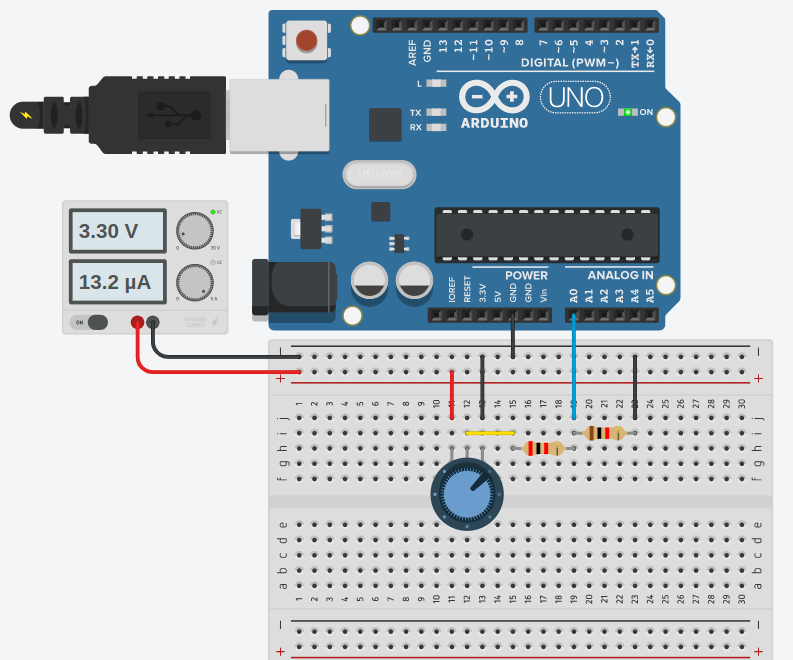

# Test tasks for the Characterization Engineer position
1. Design Python script for measuring voltage (can use Raspberry or Arduino as measuring device
and communicate via COM port):
   - Input range 0..3.3V
   - NPLC: 1, 5, 10
2. Find mean, median, mode and standard deviation for the data set (can be used MS Excel):\
```text
364, 373, 358, 394, 378, 379, 357, 364, 350, 363, 392, 368, 359, 375, 399, 365, 379, 357, 380
```

# Solution
## Base set up
Firstly, you need to clone the repo:
```cmd
git clone https://github.com/HStakhiv/atlas_magnetics_test_task.git
```

Then I recommend setting up the virtual environment and installing requirements. You can use the command below:
```cmd
$ python -m venv venv
$ venv\Scripts\activate (on Windows)
$ source venv/bin/activate (on macOS)
$ pip install -r requirements.txt
```
Now you are ready to follow the next steps.

## Task #1
### Option 1. Measurement using the built-in ADC Arduino Nano
Here, the payfirmat module is used for communication between the Arduino board and the PC.

1. Firstly, you will need to configure your Arduino Nano board.
To do this, you will need to flash the board with the firmware with the file name`StandardFirmata.ino`
that is located on the following path `/part_one/Arduino Nano/PyFirmata Arduino IDE/StandardFirmata`.\
*To install all necessary libraries in Arduino IDE, follow the following 
[link](https://realpython.com/arduino-python/#uploading-the-firmata-sketch)* \
**Note! If you use the code from the Firma example.** \
**In order to increase the accuracy of built-in measurements
ADC must be set to `analogReference(INTERNAL)` mode
in the `void setup()` of the Arduino firmware.**
2. Next, it is necessary to prepare the following scheme for measurements.\
 \
List of components:
   - Arduino Nano (Uno) - 1 psc
   - Resistor 1k Omh - 1 psc
   - Resistor 2k Omh - 1 psc
   - Potentiometer 10k Omh - 1 psc
   - Power supply 3.3 V - 1 psc \
3. Open the file `measuring_with_nano_ADC.py` and find the following line of code below 
and replace `/dev/ttyUSB0` with the port the Arduino is connected to.
```python
board = pyfirmata.Arduino("/dev/ttyUSB0")
```
4. Don't forget to set the network frequency and NPLC values.
5. Run the Python script `measuring_with_nano_ADC.py`

### Option 2. Measurement using the built-in ADC ESP32
1. Use an ESP32 GPIO 34 to read analog values.
2. Perform the configuration of the ESP32 board as described in the following 
[link](https://randomnerdtutorials.com/getting-started-thonny-micropython-python-ide-esp32-esp8266/).
2. Open the file `/part_one/ESP32/measuring_with_esp32_ADC.py` in Thonny.
3. Follow the steps in the guide above to launch the program.

### ***[You can view photos and videos of the tests by following the link](https://drive.google.com/drive/folders/1A4ihBubtxVhGk-sMJmeA6-bkXopZ1dcK?usp=share_link)***

## Task #2
1. The Excel solution is in the file `/part_two/calculating.xlsx`.
2. You can find the solution using Python in the file `/part_two/data_calculating.py`.


